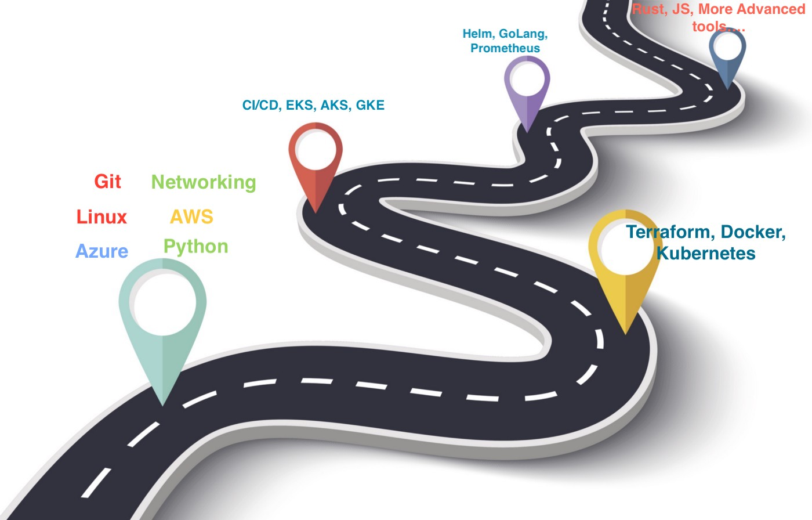

# DevOps-101-Resources

  

A collection of selected online resources that will help prepare you for the ever-evolving world of DevOps. The aim of this public repository is to provide a list of learning resources, advice and project samples to those who are new to the world of DevOps. Contributions are welcome :) 

- If you wish to contribute, please raise an issue, or make a pull request for fixes, new additions, or updates. Thank you!

## FUNDAMENTALS

### Linux

- [Linux Mastery - Paid](https://www.udemy.com/course/linux-mastery/)
- [The Complete Linux Course: Beginner to Power User! - FREE] (https://www.youtube.com/watch?v=wBp0Rb-ZJak)

### Python

- https://www.udemy.com/course/automate/ (Paid) (RECOMMENDED)
- https://www.udemy.com/course/complete-python-bootcamp/ (Paid) (SUPPLEMENTARY)
- https://www.youtube.com/watch?v=rfscVS0vtbw (FREE) (RECOMMENDED)
- https://www.youtube.com/watch?v=t8pPdKYpowI (FREE)
- https://pythoninstitute.org/certification/ (FREE/PAID)

### Amazon Web Services (AWS)

- https://portal.tutorialsdojo.com/product-category/aws/aws-digital-courses-2/ — AWS Digital Courses by Jon Bonso (FREE)
- https://www.youtube.com/watch?v=3hLmDS179YE — AWS CCP(FREE)
- https://www.udemy.com/course/aws-certified-cloud-practitioner-new/ (PAID) (PERSONAL FAVOURITE)
- https://www.youtube.com/watch?v=Ia-UEYYR44s — AWS CCP (FREE)
- https://learn.cantrill.io/p/aws-certified-solutions-architect-associate-saa-c02 — AWS SAA (Paid)
- https://www.youtube.com/watch?v=RrKRN9zRBWs — AWS Developer Associate (FREE)
- https://www.udemy.com/course/aws-certified-cloud-practitioner-practice-exams-amazon/ — AWS CCP (Paid) — EXAM PRACTICE
- https://www.udemy.com/course/aws-certified-solutions-architect-associate-amazon-practice-exams-saa-c02/ — AWS SAA Associate (Paid) — EXAM PRACTICE
- https://www.udemy.com/course/aws-certified-developer-associate-practice-exams-amazon/ — AWS Dev Associate (Paid) — EXAM PRACTICE

### Microsoft Azure:
- https://www.youtube.com/watch?v=NKEFWyqJ5XA — AZ900 (FREE)
- https://www.youtube.com/watch?v=10PbGbTUSAg — AZ104 (FREE)
- https://www.whizlabs.com/microsoft-azure-certification-az-900/ — Azure Fundamentals 900 (Paid) — WhizLabs EXAM PRACTICE
- https://www.whizlabs.com/microsoft-azure-certification-az-104/ — Azure Admin Associate 104 (Paid) — WhizLabs EXAM PRACTICE

### Google Cloud Platform (GCP)

- https://training.antonit.com/p/google-cloud-associate-cloud-engineer — GCP ACE course (Paid)
- https://www.youtube.com/watch?v=UGRDM86MBIQ — Google Digital Leader course by Andrew Brown (FREE)
- https://training.antonit.com/p/google-cloud-professional-cloud-architect — GCP Professional Cloud Architect by Antoni Tzavelas (Paid)

### Git (version control)

- https://www.youtube.com/watch?v=8JJ101D3knE (FREE)
- https://www.youtube.com/watch?v=RGOj5yH7evk (FREE)
- https://www.youtube.com/watch?v=ecK3EnyGD8o — Git Advanced (tips and tricks) (FREE)

### Networking fundamentals

- https://www.youtube.com/playlist?list=PLDQaRcbiSnqF5U8ffMgZzS7fq1rHUI3Q8 — Networking fundamentals playlist (FREE)

## ADVANCED

### Terraform

- https://www.youtube.com/watch?v=SLB_c_ayRMo (FREE)
- https://www.youtube.com/watch?v=YcJ9IeukJL8 (FREE)
- https://www.udemy.com/course/terraform-beginner-to-advanced/ (Paid)
- https://www.youtube.com/watch?v=V4waklkBC38 — Terraform Associate (FREE)
- https://www.youtube.com/watch?v=Ff0DoAmpv6w&t=6032s (FREE) — Azure DevOps with Terraform
- https://www.youtube.com/playlist?list=PLedHPfK7UwDJdS7zTgJv8PWR9UBcPbgUO (FREE) — IaC with Azure

### Containers (Docker and Kubernetes aka K8s)

- https://www.youtube.com/watch?v=p28piYY_wv8 — Docker (FREE)
- https://www.youtube.com/watch?v=3c-iBn73dDE — Docker(FREE)
- https://www.youtube.com/watch?v=fqMOX6JJhGo — Docker (FREE)
- https://www.youtube.com/watch?v=bhBSlnQcq2k — Docker & K8s (FREE)
- https://www.youtube.com/watch?v=X48VuDVv0do — K8s (FREE)
- https://www.udemy.com/course/docker-and-kubernetes-the-complete-guide/ (Paid)
- https://www.udemy.com/course/learn-kubernetes/?src=sac&kw=kubernetes+for+abs (Paid)
- https://www.udemy.com/course/certified-kubernetes-administrator-with-practice-tests/ — CKA certification course (Paid)
- https://github.com/walidshaari/Kubernetes-Certified-Administrator — CKA (FREE)
- https://github.com/walidshaari/Certified-Kubernetes-Security-Specialist — CKS (FREE)

### Continuous Integration, Continuous Development (CI/CD)

- https://www.youtube.com/watch?v=R8_veQiYBjI — GitHub Actions (FREE)
- https://www.udemy.com/course/gitlab-ci-pipelines-ci-cd-and-devops-for-beginners/ — GitLab (Paid)
- https://www.youtube.com/watch?v=FX322RVNGj4 — Jenkins(FREE)

### Managed containers (EKS/AKS/GKE)

- https://www.udemy.com/course/aws-eks-kubernetes-masterclass-devops-microservices/ — EKS (Paid)
- https://www.udemy.com/course/azure-kubernetes-service-with-azure-devops-and-terraform/ — AKS (Paid)

### More-open source tools and more things to consider learning

- https://www.youtube.com/watch?v=J4al_SZ6p5g — Free practice exams video by Andrew Brown (FREE)
- https://www.youtube.com/playlist?list=PL34sAs7_26wMW4bWKnMIfEd87aPuw75by — ArgoCD (FREE)
- https://www.youtube.com/watch?v=7gW5pSM6dlU — Prometheus monitoring tool (FREE)
- https://www.youtube.com/watch?v=YS4e4q9oBaU — GoLang Programming Language (FREE)
- https://www.youtube.com/playlist?list=PL2_OBreMn7FqZkvMYt6ATmgC0KAGGJNAN — Ansible101 by Jeff Geerling(FREE)
- https://www.youtube.com/playlist?list=PL34sAs7_26wPkw9g-5NQPP_rHVzApGpKP — Istio,Service Mesh (FREE)
- https://www.youtube.com/watch?v=3GPpm2nZb2s — Helm, package management for K8s (FREE)
- https://www.youtube.com/watch?v=UGRDM86MBIQ — Google Digital Leader course (FREE)
